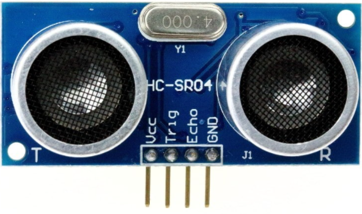

# HC-SR04_Ultrasonic Sensor with the Raspberry PI PICO

I wanted to interface my PICO with the popular HC SR-04 sensor. As you are aware, this sensor is very cheap and works like a sonar. It emits an untrasonic beep and listens to the echo from an object. 

As you can see from the above figure, the sensor has two transducers. One sends out the pulses and the other listens to the echo. 

I had a devil of a time trying to get the sensor to work on my breadboard. This is because most websites don't actually contain the correct information. I went through a dozzen websites and StackOverflow, but I could not identify the actual reason. Finally, I hit upon this video on [YouTube](https://www.youtube.com/watch?v=6F1B_N6LuKw) that I understood why my code was not working. Seems most websites simply clone and regurgitate the shit all over. 

Here is information that you will not get on most of the websites that show up on searches:

As you can see from the picture above, the sensor has three pins:

*    The VCC pin
*    Next is the Trig pin
*    Then the Echo pin
*    Finally the GND pin

While connecting the sensor to my PICO, I connected Pin 36, which is labeled 3V3 OUT on the PICO pinouts to the VCC of the sensor. Pins 16 and 17 went to the Trig and Echo and the GND was connected to one of the several GND pins on the PICO.

The sensor is supposed to be able to measure distances between 2 cm and 400 cm with an accuracy of 0.1 cm
		
To trigger the device, we need to send a 10 micro0sec pulse on the Trigger pin. The HC-SR04 will transmit 8 ultrasonic pulses.
		
The echo pin outputs a pulse between 150 micro-seconds and 25 mili-seconds depending upon the distance of the object, **or if no object is found, it will send a 38 ms pulse**. The last part is very important, because I kept getting an echo, even though there was nothing in front of the sensor! 

Interfacing the sensor with te PICO was painless. Just hold the Trig pin high for a few mili-secnds, then wait in a loop for 38 mili-seconds max. If we find a valid pulse, then we are good else we return 0 from the routing. The entire code and calculation logic is in main.c

To build the code:

* Clone the code
* mkdir build
* cd build
* cmake ../
* make

Note that the above assumes that you have already installed the PICO SDK on your machine. 

Another issue that _may_ crop up will be because I have the _pico_sdk_import.cmake_ into the repository. You can replace this with the one in your SDK, if you have issues. 

Feel free to connect with me if you have issues.
